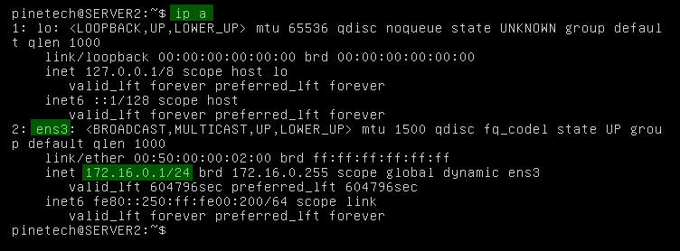
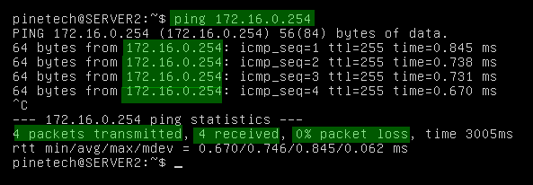
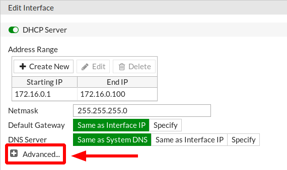
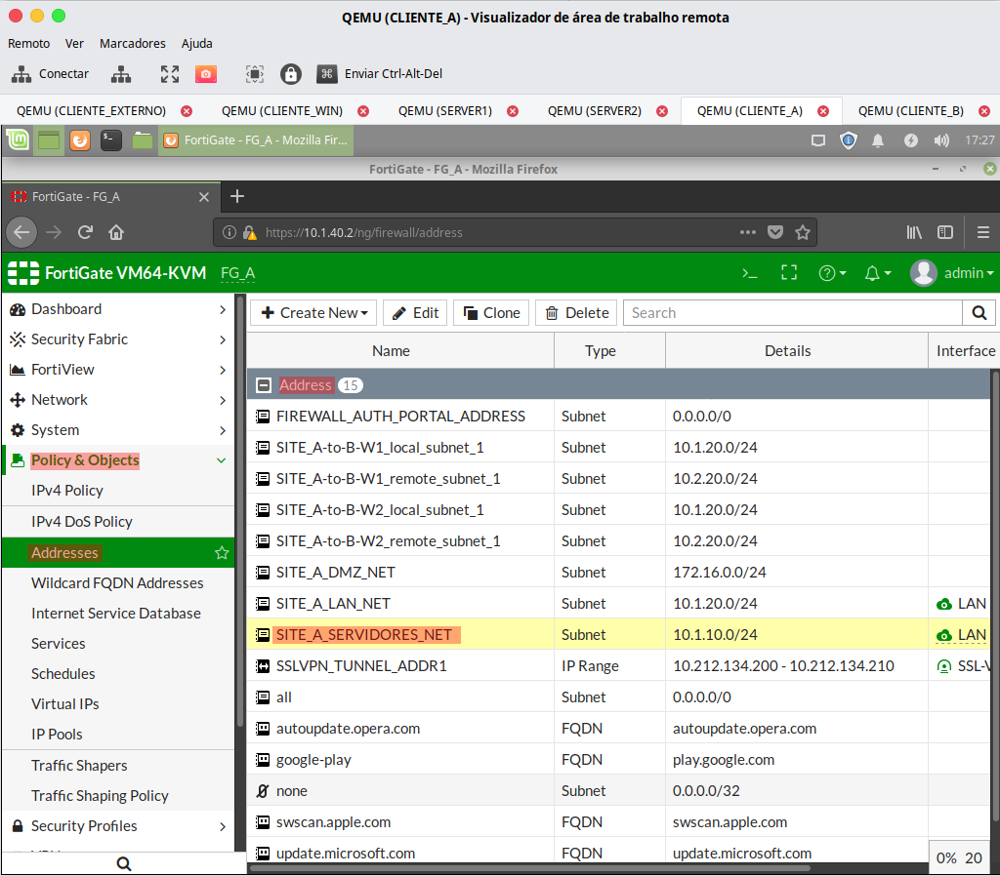
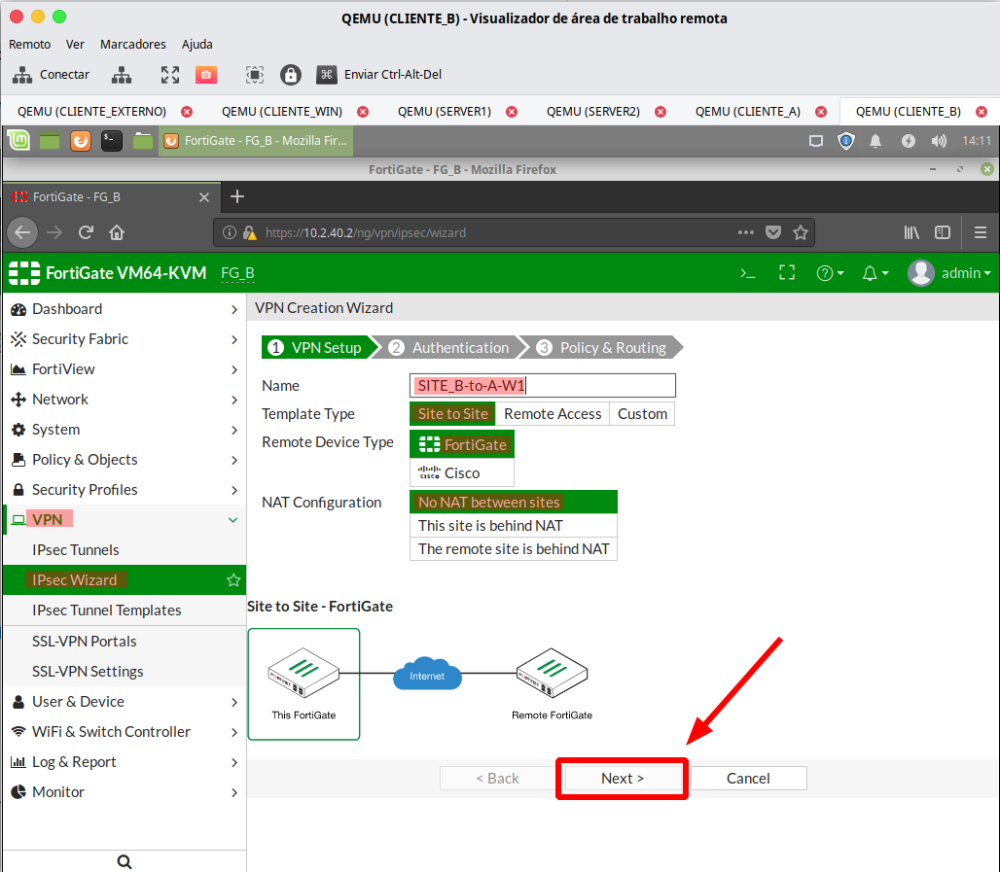
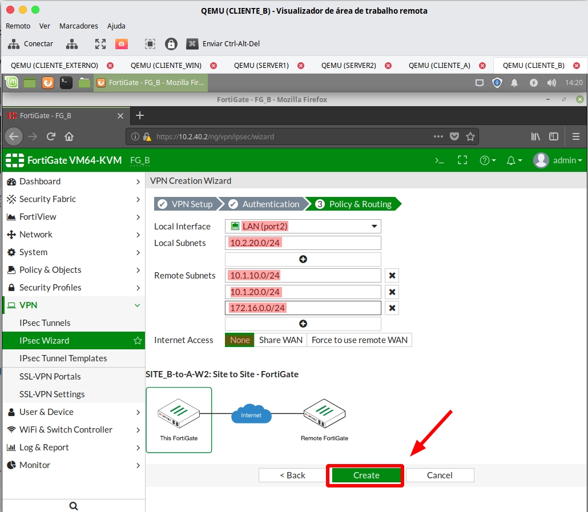
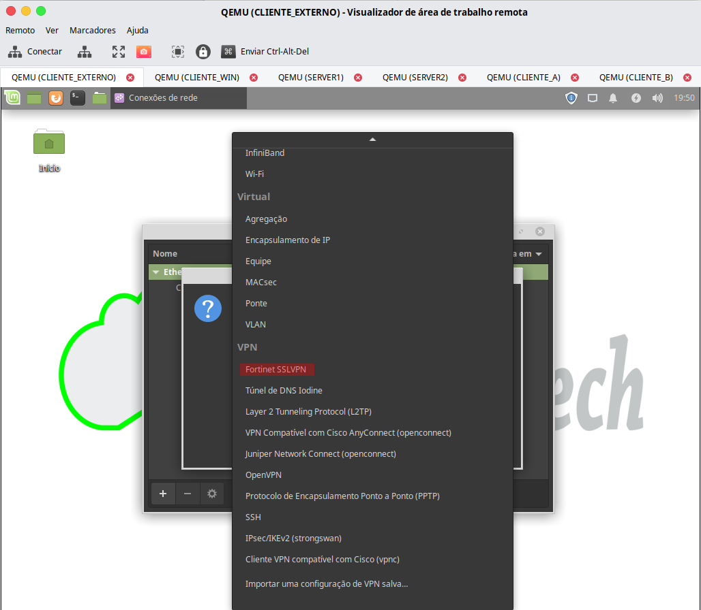
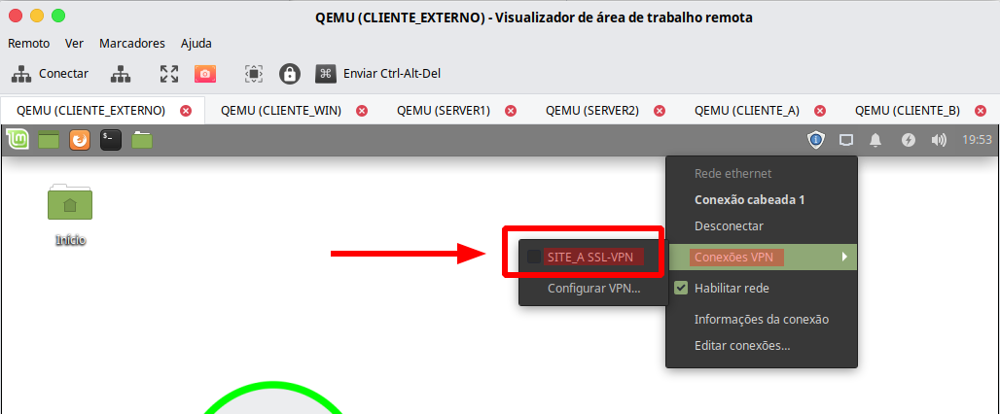

# FORTIGATE v6.0 Hands On
## LAB 01

***
### ***Índice***

* [Objetivo](#objetivo)
* [Topologia do LAB](#topologia-do-lab)
	* [Credenciais de acesso](#credenciais-de-acesso)
* [Comandos utilizados no LAB](#comandos-utilizados-no-lab)
* [ATIVIDADES DO LAB 01](#atividades-do-lab-01)
	* [Tarefa 01](#tarefa-01)
	* [Tarefa 02](#tarefa-02)
    * [Tarefa 03](#tarefa-03)
    * [Tarefa 04](#tarefa-04)
    * [Tarefa 05](#tarefa-05)
    * [Tarefa 06](#tarefa-06)
    * [Tarefa 07](#tarefa-07)
    * [Tarefa 08](#tarefa-08)
***
### ***Objetivo***
Neste lab o aluno será apresentado as configurações iniciais do ***FORTIGATE***, assim como aos comandos básicos para configurar a interface de gerencia via *CLI*.

O aluno deve seguir os passos abaixo para poder configurar os ***FG*** dos *Sites A* e *B*.
***
### ***Topologia do LAB***

***
#### ***FORTIGATES***
HOSTNAME | Port1 | Port2 | Port3
:-------:|:-----:|:-----:|:-----:
FG_A|**(WAN1)** *192.168.100.1/24*|**(LAN)** *10.1.40.2/24* **(DMZ)** *172.16.0.254/24*|**(WAN2)** *192.168.110.1/24*
FG_B|**(WAN1)** *192.168.200.1/24*|**(LAN)** *10.2.40.2/24*

***
#### ***ROTEADORES***
HOSTNAME | e0/0 | e0/1 | 0/2 | e0/3
:-------:|:----:|:----:|:---:|:---:
ISP_A|*192.168.1.**253**/24*|*192.168.100.**254**/24*|*192.168.110.**254**/24*|-
ISP_B|*192.168.2.**253**/24*|*192.168.200.**254**/24*|-|-
INTERNET|*192.168.0.**254**/24*|*DHCP CLIENT*|*192.168.1.**254**/24*|*192.168.2.**254**/24*

***
#### ***SWITCHES***
HOSTNAME | e0/0 | e0/1 | 0/2 | e0/3|VLAN10|VLAN20|VLAN40
:-------:|:----:|:----:|:---:|:---:|:----:|:----:|:----:
CORE_A|***TRUNK*** *NATIVE*(**V1**) *TAGGED*(***V30,40***)|***ACCESS*** *VLAN **20***|***ACCESS*** *VLAN **10***|***ACCESS*** *VLAN **30***|*10.1.10.**254**/24*|*10.1.20.**254**/24*|*10.1.40.**1**/24*
CORE_B|***ACCESS*** *VLAN **40***|***ACCESS*** *VLAN **20***|-|-|-|*10.2.10.**254**/24*|*10.2.40.**1**/24*

***
#### ***HOSTS***
HOSTNAME | SISTEMA | SERVIÇO | e0 | NAT
:-------:|:-------:|:-------:|:--:|:---:
CLIENTE_A|MINT 19|-|*10.1.20.**101**/24*|-
SERVER1|UBUNTU 18.04|*HTTP*|*10.1.10.**10**/24*|-
SERVER2|UBUNTU 18.04|*HTTP*|*172.16.0.**10**/24*|*192.168.100.**10***
CLIENTE_B|MINT 19|-|*10.2.20.**101**/24*|-
CLIENTE_EXTERNO|MINT 19|-|*192.168.0.**101**/24*|-

***
Os roteadores **ISP_A**, **ISP_B** e **INTERNET**, os switches **CORE_A** e **CORE_B** estão pré-configurados e o aluno não precisa realizar nenhuma intervenção de configuração nestes equipamentos, entretanto é permitido usar comandos *show*, *ping* e *tracerouter*.

Os firewalls **FG_A** e **FG_B** não estão com qualquer configuração, nestes os alunos podem executar qualquer comando.

Os hosts **CLIENTE_A**, **CLIENTE_B**, **SERVER1**, **SERVER2** e **CLIENTE_EXTERNO** não tem nenhuma limitação, apesar de que a única configuração necessária em um LAB limpo, seria alterar o hostname padrão, nestes o cliente pode fazer atividade.

***
#### ***Credenciais de acesso***

***
##### ***ROTEADORES & SWITCHES***
***Username*** = *aluno*  
***Password*** = *aluno*

***
##### ***LINUX***
***Username*** = *pinetech*  
***Password*** = *P@ssw0rd!*

***
##### ***FORTIGATE***
***Username*** = *admin*  
***Password Padrão*** = *sem senha*  
***Password a configurar*** = *P@ssw0rd!*

***
### ***Comandos utilizados no LAB***

Abaixo alguns dos comandos necessários para executar o LAB, com as devidas explicações:

***
#### ***CISCO***
COMANDO | DESCRIÇÃO
:-------|:---------
*show running-config **view full***|Mostra a configuração atual do equipamento (o view full só é necessário quando utilizada a funcionalidade *Parser View*, que o caso deste LAB)
*ping **ip_address***|Executa um ping para o ***ip_address*** especificado
*traceroute **ip_address***|Executa um traceroute para o ***ip_address*** especificado
*show ip route*|Exibe a tabela de rotas do equipamento
*show ip interface brief*|Exibe o endereço IP das interfaces do equipamento
*show vlan*|Exibe as VLANs e as portas associadas as mesmas (somente switch)

***
#### ***LINUX***
COMANDO | DESCRIÇÃO
:-------|:---------
*sudo hostnamectl set-hostname **new_hostname***|Altera o hostname do equipamento para o ***new_hostname*** 
*ip a*|Exibe a configuração IP das interfaces do equipamento
*ping **ip_address***|Executa um ping para o ***ip_address*** especificado
*traceroute **ip_address***|Executa um traceroute para o ***ip_address*** especificado
*route*|Exibe a tabela de rotas do equipamento
*sudo systemctl restart NetworkManager.service*|Recarrega as configurações de rede no ***MINT 19***
*sudo netplan apply*|Recarrega as configurações de rede no ***UBUNTU 18.04***

***
#### ***FORTIOS***
COMANDO | DESCRIÇÃO
:-------|:---------
*execute factoryreset*|Apaga toda a configuração do equipamento, e volta ao estado padrão de fábrica
*execute reboot*|Reinicia o equipamento
*execute shutdown*|Desliga o equipamento
*config system global*|Entra na configuração Globa do Systema
*set hostname **new_hostname***|Altera o hostname do equipamento para ***new_hostname*** (dentro do System Global)
*end*|Sai e aplica as configurações
*abort*|Sai e descarta as alterações
*show*| (dentro do config) Exibe as configurações do módulo especifico
*show*| (fora do config) Exibe toda a configuração do equipamento
*show **módulo***| (fora do config) Exibe a configuração do ***módulo*** especificado
*get **módulo*** | (fora do config) Obtém e exibe valores de processos do equipamento

***
## ATIVIDADES DO LAB 01

***
### Tarefa 01

O aluno deve executar as configurações iniciais no ***FG_A*** via *CLI*, para obter acesso a interface *WEB* do equipamento.

***
1. O aluno deve acessar o LAB 01.

***
2. Depois deve clicar em ***More actions***, e depois ***Start all nodes***

***
3. Aguardar os equipamentos mudarem da cor cinza para azul.

***
4. ***Clicar no icone do FG_A***.

***
5. Deve abrir uma sessão de terminal com o *prompt* de *login* do roteador ***FortiGate-VM64-KVM login:***

***
6. Efetue o login com as credenciais fornecidas acima.

***
7. Execute o script abaixo para alterar o Hostname:

>
	# Entrar no modo de configuração Global do Systema
    #
	config system global
    #
	# Altera o hostname para FG_A
    #
    set hostname FG_A
    #
    # Aplicar a configuração e sai
    #
    end

***
8. Entra no modo de cofniguração de Interfaces e verificar quais portas estão disponíveis no equipamento

>
	# Entrar no modo de configuração de Interfaces
    #
    config system interface
    #
    # Exibir a configuração das interfaces
    #
    show

Compare com a saída de exemplo abaixo:

>
    # Compare com a saída abaixo:
    #
    FG_A (interface) # show
    config system interface
        edit "port1"
            set vdom "root"
            set mode dhcp
            set allowaccess ping https ssh http fgfm
            set type physical
            set snmp-index 1
        next
        edit "port2"
            set vdom "root"
            set type physical
            set snmp-index 2
        next
        edit "port3"
            set vdom "root"
            set type physical
            set snmp-index 3
        next
        edit "port4"
            set vdom "root"
            set type physical
            set snmp-index 4
        next
        edit "ssl.root"
            set vdom "root"
            set type tunnel
            set alias "SSL VPN interface"
            set snmp-index 5
        next
        end

***
9. Para configurar uma Interface ***LAN*** e associar a ***VLAN 40 - TRANSITO***, execute o script abaixo:

>
	# criar uma nova Interface LAN
    #
    edit LAN
    #
    # Adicionar a nova Interface no VDOM root
    #
    set vdom root
    #
    # Habilitar acessos Administrativods e ICMP
    #
    set allowaccess ping https ssh http fgfm
    #
    # Associar com a Porta física Port2
    #
    set interface port2
    #
    # Alterar o tipo de Interface para VLAN
    #
    set type vlan
    #
    # Associar a VLAN 40
    #
    set vlanid 40
    #
    # Atribuir o IP 10.1.40.2/24 na Interface
    #
    set ip 10.1.40.2/24
    #
    # Aplicar a configuração e sai
    #
    end

***
10. Verificar o Status e a Conectividade da Interface LAN:

**a)** Verificar o Status da Interface LAN 
>
    # Obtém o status das interfaces do Sistema
    #
    get system interface

Compare com a saída abaixo:

>
    FG_A # execute ping 10.1.40.1
    == [ port1 ]
    name: port1   mode: dhcp    ip: 0.0.0.0 0.0.0.0   status: up    netbios-forward: disable    type: physical   
    netflow-sampler: disable    sflow-sampler: disable    scan-botnet-connections: disable    src-check: enable    
    mtu-override: disable    wccp: disable   drop-overlapped-fragment: disable    drop-fragment: disable    
    == [ port2 ]
    name: port2   mode: static    ip: 0.0.0.0 0.0.0.0   status: up    netbios-forward: disable    type: physical   
    netflow-sampler: disable    sflow-sampler: disable    scan-botnet-connections: disable    src-check: enable   
    mtu-override: disable    wccp: disable    drop-overlapped-fragment: disable    drop-fragment: disable    
    == [ port3 ]
    name: port3   mode: static    ip: 0.0.0.0 0.0.0.0   status: up    netbios-forward: disable    type: physical   
    netflow-sampler: disable    sflow-sampler: disable    scan-botnet-connections: disable    src-check: enable   
    mtu-override: disable    wccp: disable    drop-overlapped-fragment: disable    drop-fragment: disable    
    == [ port4 ]
    name: port4   mode: static    ip: 0.0.0.0 0.0.0.0   status: up    netbios-forward: disable    type: physical   
    netflow-sampler: disable    sflow-sampler: disable    scan-botnet-connections: disable    src-check: enable    
    mtu-override: disable    wccp: disable    drop-overlapped-fragment: disable    drop-fragment: disable    
    == [ ssl.root ]
    name: ssl.root   ip: 0.0.0.0 0.0.0.0   status: up    netbios-forward: disable    type: tunnel   
    netflow-sampler: disable    sflow-sampler: disable    scan-botnet-connections: disable    src-check: enable    
    wccp: disable    
    == [ LAN ]
    name: LAN   mode: static    ip: 10.1.40.2 255.255.255.0   status: up    netbios-forward: disable    
    type: vlan   netflow-sampler: disable    sflow-sampler: disable    scan-botnet-connections: disable    
    src-check: enable    mtu-override: disable    wccp: disable    drop-overlapped-fragment: disable    
    drop-fragment: disable

**b)** Verificar a conectividade com o Switch ***CORE_A***:

>
    # Executa um ping para 10.1.40.1
    #
    execute ping 10.1.40.1
    #

Compare com a saída abaixo:

>
    FG_A # execute ping 10.1.40.1
    PING 10.1.40.1 (10.1.40.1): 56 data bytes
    64 bytes from 10.1.40.1: icmp_seq=0 ttl=255 time=0.7 ms
    64 bytes from 10.1.40.1: icmp_seq=1 ttl=255 time=1.0 ms
    64 bytes from 10.1.40.1: icmp_seq=2 ttl=255 time=0.9 ms
    64 bytes from 10.1.40.1: icmp_seq=3 ttl=255 time=0.6 ms
    64 bytes from 10.1.40.1: icmp_seq=4 ttl=255 time=0.6 ms

    --- 10.1.40.1 ping statistics ---
    5 packets transmitted, 5 packets received, 0% packet loss
    round-trip min/avg/max = 0.6/0.7/1.0 ms

**c)** Verificar a conectividade com o Host ***CLIENTE_A***:

>
    # Executa um ping para 10.1.20.101
    #
    execute ping 10.1.20.101
    #

Compare com a saída abaixo:

>
    FG_A # execute ping 10.1.20.101
    PING 10.1.20.101 (10.1.20.101): 56 data bytes
    sendto failed
    sendto failed
    sendto failed
    sendto failed
    sendto failed

    --- 10.1.20.101 ping statistics ---
    5 packets transmitted, 0 packets received, 100% packet loss

***
11. Para configurar uma rota para as redes locais do ***SITE A***, execute o script abaixo:

**a)** Criar a Rota

>
	# Entrar no modo de configuração de Rotas Estáticas
    #
    config router static
    #
    # Exibir as Rotas Estáticas existentes
    #
    show

Compare com a saída abaixo:

>
    FG_A (static) # show
    config router static
    end

**b)** No momento não temos nenhuma Rota Estática criada no equipamento, vamos criar uma:

>
    # Criar uma entrada no Índice de Rotas 
    #
    edit 0
    #
    # Especificar a rede destino
    #
    set dst 10.1.0.0/16
    #
    # Especificar a Interface de Saída
    #
    set device LAN
    #
    # Especificar o Gateway da Rota
    #
    set gateway 10.1.40.1
    #
    # Aplica a configuração e sai
    #
    end

**c)** Verificar a tabela de rotas do Sistema:

>
    # Obtem e exibe a tabela de rotas global do equipamento
    #
    get router info routing-table all

Compare com a saída abaixo:

>
    FG_A # get router info routing-table all 

    Routing table for VRF=0
    Codes: K - kernel, C - connected, S - static, R     - RIP, B - BGP
        O - OSPF, IA - OSPF inter area
        N1 - OSPF NSSA external type 1, N2 - OSPF NSSA external type 2
        E1 - OSPF external type 1, E2 - OSPF external type 2
        i - IS-IS, L1 - IS-IS level-1, L2 - IS-IS level-2, ia - IS-IS inter area
        * - candidate default

    S       10.1.0.0/16 [10/0] via 10.1.40.1, LAN
    C       10.1.40.0/24 is directly connected, LAN

**d)** Verificar a conectividade com o Host ***CLIENTE_A***:

>
    # Executa um ping para 10.1.20.101
    #
    execute ping 10.1.20.101
    #

Compare com a saída abaixo:

>
    FG_A # execute ping 10.1.20.101
    PING 10.1.20.101 (10.1.20.101): 56 data bytes
    64 bytes from 10.1.20.101: icmp_seq=0 ttl=63 time=2.3 ms
    64 bytes from 10.1.20.101: icmp_seq=1 ttl=63 time=2.4 ms
    64 bytes from 10.1.20.101: icmp_seq=2 ttl=63 time=0.9 ms
    64 bytes from 10.1.20.101: icmp_seq=3 ttl=63 time=1.1 ms
    64 bytes from 10.1.20.101: icmp_seq=4 ttl=63 time=0.6 ms

    --- 10.1.20.101 ping statistics ---
    5 packets transmitted, 5 packets received, 0% packet loss
    round-trip min/avg/max = 0.6/1.4/2.4 ms

***
### Tarefa 02

O aluno deve acessar a Interface *WEB* do ***FG_A***\.

***
1. O aluno deve acessar o ***CLIENTE_A***\.

***
2. Efetue login com as credênciais fornecidas no inicio do LAB

***
3. Abra o Navegador Firefox

***
4. Digite o endereço 10.1.40.2 no Firefox para acessar a tela de Login do FortiGate FG_A, e efetue login com o usuário ***admin*** sem senha.

***
5. Será exibida uma mensagem alertando que a senha dever alterada.

***
6. Altere o password para ***P@ssw0rd!***

***
7. Efetue login com o usuário ***admin*** e a senha ***P@ssw0rd!***

Se o Login for bem sucedido o Fortigate ***FG_A*** deve redirecionar para uma página exibindi o *Dashboard*\.

***
### Tarefa 03

O aluno deve completar a configuração do ***FG_A*** para permitir o acesso dos Hosts do ***SITE A*** a *Internet*\.

***
1. Configurar a uma nova Interface ***DMZ***\:

**a)** Acessar a configuração de uma nova Interface:

**b)** Prencha os campos com as informações Abaixo:

*Interface Name*: ***VLAN30***  
*Alias*: ***DMZ***  
*Type*: ***VLAN***  
*Interface*: ***port2***  
*VLAN ID*: ***30***  

*Role*: ***Undefined***

*Addressing Mode*: ***Manual***  
*IP/Network Mask*: ***172.16.0.254/24***

*Administrative Access*: ***PING***

*DHCP Server*: ***Enable***

**c)** Em ***Anddress Range***, Clique em ***+Create New***

*Starting IP*: ***172.16.0.1***  
*End IP*: ***172.16.0.100***

*Network*: ***255.255.255.0***

Deixe as demais opções nos valores padão, e clique no botão ***OK***\.
***
2. Verificar se o ***SERVIDOR2*** obtem IP e acessa o IP da Interface DMZ do ***FG_A***\.

**a)** Efetuar login no ***SERVIDOR2*** com as credencias informadas no inicio do LAB.

**b)** Utilize o comando ***ip a*** para verificar as configurações da Interface ***ens3***

**c)** Execute um ping para o IP da Interface *DMZ* do ***FG_A***, depois de algumas respostas tecle ***CTRL+C*** para interromper.

***
3. Criar um *Lease DHCP Fixo* (Reserva) para o ***SERVER2*** no ***FG_A***\:

**a)** Selecione a Interface *DMZ* e clique no botão *Edit*

**b)** Navegue até a seção de DHCP e expanda ***\+ Advanced***

**c)** Execute o comando **ip a** no ***SERVER2*** e anote o *MAC Address* da Interface *ens3*\.

**d)** Retorne a Interface *WEB* do ***FG_A*** e navegue até a **MAC Reservation + Access Control**, preencha com os dados abaixo:

*MAC Address*: ***00:50:00:00:02:00***  
*Action or IP*: ***Reserve IP | 172.16.0.10***  
*Description*: ***SERVER2***

Clique no botão ***OK***

**e)** Acesse o ***SERVER2***, execute o comando **sudo netplan apply** para renovar o IP, e depis **ip a** para verificar se obteve o IP Reservado.

***
4. Configurar Interfaces *WAN1* no ***FG_A***\.

**a)** Em **Network > Interfaces > *Port1*** selecione *Edit*

_1.png)

Prencha os campos com as informações Abaixo:

*Alias*: ***WAN1***

*Addressing mode*: ***Manual***  
*IP/Network Mask*: ***192.168.100.1/24***

*Role*: ***WAN***

*Administrative Access (IPv4)*: ***PING***

Deixe as demais opções nos valores padão, e clique no botão ***OK***\.

***
5. Configurar Interfaces *WAN2* no ***FG_A***\.

**a)** Em **Network > Interfaces > *Port3*** selecione *Edit*

_1.png)

Prencha os campos com as informações Abaixo:

*Alias*: ***WAN2***

*Addressing mode*: ***Manual***  
*IP/Network Mask*: ***192.168.110.1/24***

*Role*: ***WAN***

*Administrative Access (IPv4)*: ***PING***

Deixe as demais opções nos valores padão, e clique no botão ***OK***\.

***
6. Configurar rota default para *WAN1* no ***FG_A***\.

**a)** Em **Network > Static Routes** clique em *+ Create New*

_1.png)

Prencha os campos com as informações Abaixo:

*Destination*: ***Subnet | 0.0.0.0/0.0.0.0***  
*Gateway*: ***192.168.100.254***  
*Interface*: ***WAN1 (port1)***

_2.png)

Deixe as demais opções nos valores padão, e clique no botão ***OK***\.

**b)** Verificar se o ***FG_A*** tem acesso a *Internet*.

Clique no icone [ **>_** ] e execute o comando abaixo:

>
    execute ping 8.8.8.8

**c)** Verificar se o ***CLIENTE_A*** tem acesso a *Internet*.

Abra um novo terminal, clicando no icone indicado na imagem, e execute o comando abaixo:

>
    ping 8.8.8.8

Espere alguns segundos e use a combinação de telcas **CTRL+C**\.

O ***CLIENTE_A*** ainda não tem acesso a *Internet*\.

***
7. Criar uma *Regra (Policy) de Acesso* permitindo o acesso das Redes Locais do **SITE_A** para a *Internet*\.

**a)** Em **Policy & Objects > Addresses** clique em *+ Create New | Address*\.

Vamos criar os Objetos correspondente as Redes para facilitar a criação das Regras.

Prencha os campos com as informações Abaixo:

*Name*: ***SITE_A_LAN_NET***  
*Subnet / IP Range*: ***10.1.20.0/24***  
*Interface*: ***LAN***  
*Comments*: ***SITE_A LAN Subnet***

Deixe as demais opções nos valores padão, e clique no botão ***OK***\.

**b)** Em **Policy & Objects > Addresses** clique em *+ Create New | Address*\.

Prencha os campos com as informações Abaixo:

*Name*: ***SITE_A_SERVIDORES_NET***  
*Subnet / IP Range*: ***10.1.10.0/24***  
*Interface*: ***LAN***  
*Comments*: ***SITE_A SERVIDORES Subnet***

Deixe as demais opções nos valores padão, e clique no botão ***OK***\.

**c)** Em **Policy & Objects > Addresses** clique em *+ Create New | Address*\.

*Name*: ***SITE_A_DMZ_NET***  
*Subnet / IP Range*: ***172.16.0.0/24***  
*Interface*: ***DMZ (VLAN30)***  
*Comments*: ***SITE_A DMZ Subnet***

Deixe as demais opções nos valores padão, e clique no botão ***OK***\.

**d)** Em **Policy & Objects > Addresses** clique em *+ Create New | Address Group*\.

Prencha os campos com as informações Abaixo:

Name*: ***SITE_A_LAN_NETS***  
*Members*: ***SITE_A_LAN_NET | SITE_A_SERVIDORES_NET***  
*Comments*: ***SITE_A ALL LAN Subnets***

Deixe as demais opções nos valores padão, e clique no botão ***OK***\.

**e)** Em **Policy & Objects > IPv4 Policy** clique em *+ Create New*\.

Prencha os campos com as informações Abaixo:

*Name*: ***LAN-to-WAN***  
*Incoming Interface*: ***LAN***  
*Outgoing Interface*: ***WAN1 (port1)***  
*Source*: ***SITE_A_LAN_NETS***  
*Destination*: ***all***  
*Service*: ***ALL***  
*Action*: ***ACCEPT***  

*NAT*: ***ENABLED***  
*IP Pool Configuration*: ***Use Outgoing Interface Address***

*Comments*: ***Permite acesso das Subnets da Interface LAN a Internet via WAN1***

Deixe as demais opções nos valores padão, e clique no botão ***OK***\.

**f)** Verificar se o ***CLIENTE_A*** tem acesso a *Internet*.

Abra um novo terminal, clicando no icone indicado na imagem, e execute o comando abaixo:

>
    ping 8.8.8.8

Espere alguns segundos e use a combinação de telcas **CTRL+C**\.

*Ignorar a perda de pacotes, é o problema no meu acesso a Internet*\.

***
8. Aplicar uma Licença no ***FG_A***\.

**a)** Em **Dashboard > Main** clique em *FGVMEV License | FortiGate VM License*\.

**b)** Clique no botão **+ Upload**\.

**c)** Selecione o Arquivo da .LIC correto.

**d)** Clique no botão **OK** para aplicar.

**e)** Aguarde o ***FG_A*** reiniciar.

**f)** Confira se a Licença foi aplicada corretamente.

***
### TAREFA 04

O aluno deve completar a configuração do **SD-WAN** no ***FG_A*** para permitir o acesso dos Hosts do ***SITE A*** a *Internet* por ambas as Interfaces *WAN*\.

***
1. Ativar Interface **SD-WAN** no ***FG_A***\.

Ativando o SD-WAN o FG_A pode utilizar todas as Interfaces WAN para o Trafego.

**a)** Em **Network > SD-WAN**\:

Altere o Status para **Enable**\.

**b)** Em SD-WAN Interface Members clique em **[+]**

**c)** Prencha os campos com as informações abaixo:

*Interface*: ***WAN2 (port3)***  
*Gateway*: ***192.168.110.254***  

**[!]** Observe que a Interface WAN1 não aparece na lista de Interfaces disponíveis.

Clique no botão **Apply** para aplicar a configuração.

***
2. Alterar a *Rota Default* para utilizar a Interface **SD-WAN**\.

**a)** Em **Network > Static Routes** selecione a Rota com destino *0.0.0.0/0* e clique no botao **Edit**\.

_3.png)

**b)** Alterar o campo *Interface*: ***SD-WAN***

Clique no botão **OK** para aplicar a alteração.

***
3. Alterar a *Policy IPv4* e alterar a *Outgoing Interface* para ***SD-WAN***\.

**a)** Em **Policy & Objects > IPv4 Policy** selecione a Policy ***LAN-to-WAN*** e depois clique no botão **Edit**\.

**b)** Alterar o campo *Outgoing Interface*: ***SD-WAN***

Clique no botão **OK** para aplicar a alteração.

***
4. Adicionar a Interface **WAN1** ao **SD-WAN**\.

**a)** Em **Network > SD-WAN**\:

**b)** Em SD-WAN Interface Members clique em **[+]**

**c)** Prencha os campos com as informações abaixo:

**[!]** Observe que a Interface WAN1 agora aparece na lista de Interfaces disponíveis.

*Interface*: ***WAN1 (port1)***  
*Gateway*: ***192.168.100.254***  

Clique no botão **Apply** para aplicar a configuração.

***
5. Alterar o Balanceamento do **SD-WAN** para provar que está saindo por ambas as Interfaces **WAN1** e **WAN2**\.

**a)** Em **Network > SD-WAN Rules** selecione a Regra e clique no botão **Edit**\.

**b)** Alterar o *Load Balancing Algorithm* para **Source-Destination IP**\.

Clique no botão **OK** para aplicar a alteração.

***
6. Validar a utilização dos Liks WAN

**a)** Abra um novo terminal no ***CLIENTE_A*** e execute o comando abaixo:

>
    traceroute 8.8.8.8

**[!]** Observe que foi utilizada a Interface WAN2

**b)** Abra um novo terminal no ***CLIENTE_A*** e execute o comando abaixo:

>
    traceroute 1.1.1.1

**[!]** Observe que foi utilizada a Interface WAN1
 
 ***
 ### TAREFA 05

 Vamos aplicar o que aprendemos nas tarefas anterios para configurar o ***FG_B***\.

***
 1. Configuração inicial via *CLI* do ***FG_B***\.
 
 **a)** Abrir a console do ***FG_B*** aplicar o script abaixo: 

 >
    config system global
    set hostname FG_B
    end

    config system interface
    edit port2
    set alias "LAN"
    set allowaccess ping https ssh http fgfm
    set ip 10.2.40.2/24
    end

    config router static
    edit 0
    set dst 10.2.0.0/16
    set device port2
    set gateway 10.2.40.1
    end

**b)** Verificar a conectividade com o Host ***CLIENTE_B***\: 

>
    execute ping 10.2.20.101

Compare com a saída abaixo:

>
    FG_B # execute ping 10.2.20.101
    PING 10.2.20.101 (10.2.20.101): 56 data bytes
    64 bytes from 10.2.20.101: icmp_seq=0 ttl=63 time=0.9 ms
    64 bytes from 10.2.20.101: icmp_seq=1 ttl=63 time=0.6 ms
    64 bytes from 10.2.20.101: icmp_seq=2 ttl=63 time=1.2 ms
    64 bytes from 10.2.20.101: icmp_seq=3 ttl=63 time=0.7 ms
    64 bytes from 10.2.20.101: icmp_seq=4 ttl=63 time=0.9 ms

    --- 10.2.20.101 ping statistics ---
    5 packets transmitted, 5 packets received, 0% packet loss
    round-trip min/avg/max = 0.6/0.8/1.2 ms

***
2. Configurar interface **SD-WAN** no ***FG_B***\.

**a)** Acessar a Interface WEB do ***FG_B*** via http://10.2.40.2 no Host ***CLIENTE_B***\.

**b)** **Em Network > Interfaces** selecione a Interface ***port1*** e clique no botão **Edit**\.

**c)** Prencha os campos com as informações abaixo:

*Alias*: ***WAN***  
*Role*: ***WAN***  
*Addressing mode*: ***Manual***  
*IP/Network Mask*: ***192.168.200.1/24***  
*Administrative Access IPv4*: ***PING***  

Deixe as demais opções nos valores padão, e clique no botão ***OK***\.

**d)** Em **Network > SD-WAN** alterar *Status* para **Enable**\.

**e)** Adicione a Interface **WAN (port1)** como *SD-WAN Interface Members*\.

**f)** No campo *Gateway* entre o endereço IP **192.168.200.254**\.

**g)** Clique no botão **Apply** para aplicar as alterações\.

***
3. Criar *Rota Default* no ***FG_B***\.

**a)** Em **Network > Static Routes** clique no botão **+ Create New**\.

**b)** Altere o campo *Interface* para ***SD-WAN***\.

**c)** Clique no botão **OK** para aplicar a configuração\.

***
4. Criar *Object Address* e *Policy IPv4* permitindo a **LAN** do **SITE_B** acessar a Internet\.

**a)** Em **Policy & Objects > Addresses** clicar no botão **+ Create New | Address**\.

**b)** Prencha os campos com as informações abaixo:

*Name*: ***SITE_B_LAN_NET***  
*Type*: ***Subnet***  
*Subent / IP Range*: ***10.2.20.0/24***  
*Interface*: ***LAN (port2)***  
*Comments*: ***SITE_B LAN Subnet***

**c)** Clique no botão **OK** para aplicar a configuração\.

**d)** Em **Policy & Objects > IPv4 Policy** clicar no botão **+ Create New**\.

**e)** Prencha os campos com as informações abaixo:

*Name*: ***LAN-to-WAN***  
*Incoming Interface*: ***LAN (port2)***  
*Outgoing Interface*: ***SD-WAN***  
*Source*: ***SITE_B_LAN_NET***  
*Destination*: ***all***  
*Service*: ***ALL***  
*Comments*: ***Permite acesso das Subnets da Interface LAN a Internet via SD-WAN***

**f)** Clique no botão **OK** para aplicar a configuração\.

***
5. Validar o acesso a Internet do ***CLIENTE_B***\.

**a)** Abra um novo terminal no ***CLIENTE_B*** e execute o comando abaixo:

>
    ping 8.8.8.8

***
6. Aplicar uma Licença no ***FG_B***\.

**a)** Em **Dashboard > Main** clique em *FGVMEV License | FortiGate VM License*\.

**b)** Clique no botão **+ Upload**\.

**c)** Selecione o Arquivo  **~\Downloads\FGVM010000167606.lic**\.

**d)** Clique no botão **OK** para aplicar.

**e)** Aguarde o ***FG_B*** reiniciar.

**f)** Confira se a Licença foi aplicada corretamente.

***
 ### TAREFA 06

 Vamos configurar uma VPN *SITE-to-SITE* entre o **SITE_A** e o **SITE_B**\.

***
 1. Configurar a *VPN SITE-to-SITE* no ***FG_A***\.

 **a)** Em **VPN > IPsec Wizard > (1) VPN Setup**, prencha os campos com as informações abaixo\:

*Name*: ***SITE_A-to-B-W1***  
*Template Type*: ***Site to Site***  
*Remote Device Type*: ***FortiGate***  
*NAT Configuration*: ***No NAT between sites***  

Clique no botão **Next >** para prosseguir\.

 
**b)** Em **(2) Authentication**, prencha os campos com as informações abaixo\:

*Remote Device*: ***IP Address***  
*IP Address*: ***192.168.200.1*** (endereço WAN do FG_B)  
*Outgoing Interface*: ***WAN1 (port1)***  
*Authentication Method*: ***Pre-shared Key***  
*Pre-shared Key*: ***P@ssw0rd!***

Clique no botão **Next >** para prosseguir\.

**c)** Em **(3) Authentication**, prencha os campos com as informações abaixo\:

*Local Interface*: ***LAN***  
*Local Subnets*: ***10.1.20.0/24***    
*Remote Subnets*: ***10.2.20.0./24***  
*Internet Access*: ***None***  

Clique no botão **Create** para concluir\.

**d)** Em **VPN > IPsec Wizard > (1) VPN Setup**, prencha os campos com as informações abaixo\:

*Name*: ***SITE_A-to-B-W2***  
*Template Type*: ***Site to Site***  
*Remote Device Type*: ***FortiGate***  
*NAT Configuration*: ***No NAT between sites***  

Clique no botão **Next >** para prosseguir\.

 
**e)** Em **(2) Authentication**, prencha os campos com as informações abaixo\:

*Remote Device*: ***IP Address***  
*IP Address*: ***192.168.200.1*** (endereço WAN do FG_B)  
*Outgoing Interface*: ***WAN2 (port3)***  
*Authentication Method*: ***Pre-shared Key***  
*Pre-shared Key*: ***P@ssw0rd!***

Clique no botão **Next >** para prosseguir\.

**f)** Em **(3) Authentication**, prencha os campos com as informações abaixo\:

*Local Interface*: ***LAN***  
*Local Subnets*: ***10.1.20.0/24***    
*Remote Subnets*: ***10.2.20.0./24***  
*Internet Access*: ***None***  

Clique no botão **Create** para concluir\.

**g)** Alterar *Object Address* **SITE_A_DMZ_NET**:

Quando criamos o *Object Address* ***SITE_A_DMZ_NET***, associamos o mesmo a interface ***DMZ***, com isso esse Objecto só pode ser adicionado a *Objects Address Group* que utilizem a mesma interface.

Como precisamos adicionar adicionar o **SITE_A_DMZ_NET** nos grupos criados pelo **Wizard VPN**, temos que alterar a interface para **any**\.

**h)** Alterar *Object Address* **SITE_A_SERVIDORES_NET**:

**i)** Alterar *Object Address Group* criados pelo **Wizard VPN**\:

***
2. Configurar a *VPN SITE-to-SITE* no ***FG_B***\.

**a)** Em **VPN > IPsec Wizard > (1) VPN Setup**, prencha os campos com as informações abaixo\:

*Name*: ***SITE_B-to-A-W1***  
*Template Type*: ***Site to Site***  
*Remote Device Type*: ***FortiGate***  
*NAT Configuration*: ***No NAT between sites***  

Clique no botão **Next >** para prosseguir\.

 
**b)** Em **(2) Authentication**, prencha os campos com as informações abaixo\:

*Remote Device*: ***IP Address***  
*IP Address*: ***192.168.100.1*** (endereço WAN1 do FG_A)  
*Outgoing Interface*: ***WAN1 (port1)***  
*Authentication Method*: ***Pre-shared Key***  
*Pre-shared Key*: ***P@ssw0rd!***

Clique no botão **Next >** para prosseguir\.

**c)** Em **(3) Authentication**, prencha os campos com as informações abaixo\:

*Local Interface*: ***LAN (port2)***  
*Local Subnets*: ***10.2.20.0/24***    
*Remote Subnets*: ***10.1.10.0./24 | 10.1.20.0/24 | 172.16.0.0/24***  
*Internet Access*: ***None***  

Clique no botão **Create** para concluir\.

 
 **d)** Em **VPN > IPsec Wizard > (1) VPN Setup**, prencha os campos com as informações abaixo\:

*Name*: ***SITE_B-to-A-W2***  
*Template Type*: ***Site to Site***  
*Remote Device Type*: ***FortiGate***  
*NAT Configuration*: ***No NAT between sites***  

Clique no botão **Next >** para prosseguir\.

 
**b)** Em **(2) Authentication**, prencha os campos com as informações abaixo\:

*Remote Device*: ***IP Address***  
*IP Address*: ***192.168.110.1*** (endereço WAN2 do FG_A)  
*Outgoing Interface*: ***WAN1 (port1)***  
*Authentication Method*: ***Pre-shared Key***  
*Pre-shared Key*: ***P@ssw0rd!***

Clique no botão **Next >** para prosseguir\.

**c)** Em **(3) Authentication**, prencha os campos com as informações abaixo\:

*Local Interface*: ***LAN (port2)***  
*Local Subnets*: ***10.2.20.0/24***    
*Remote Subnets*: ***10.1.10.0./24 | 10.1.20.0/24 | 172.16.0.0/24***  
*Internet Access*: ***None***  

Clique no botão **Create** para concluir\.

***
3. Testar Conectividade do ***CLIENTE_B*** para os recursos do ***SITE_A***\.

**a)** Efetuar ping para o host ***CLIENTE_A*** (10.1.20.101)\:

**b)** Efetuar ping para o host ***SERVER1*** (10.1.10.10)\:

**c)** Efetuar ping para o host ***SERVER2*** (172.16.0.10)\:

**b)** Acessar o host ***SERVER1*** (10.1.10.10) via HTTP\:

**c)** Acessar o host ***SERVER2*** (172.16.0.10) via HTTP\:

***
 ### TAREFA 07

 Vamos configurar uma VPN *CLIENT-to-SITE* no **SITE_A**\.

***
 1. Configurar a *VPN CLIENT-to-SITE* no ***FG_A***\.

**a)** Em **VPN > IPsec Wizard > (1) VPN Setup**, prencha os campos com as informações abaixo\:

*Name*: ***CLIENTVPN***  
*Template Type*: ***Remote Access***  
*Remote Device Type*: ***Client-based | FortiClient***    

Clique no botão **Next >** para prosseguir\.

**b)** Em **(2) Authentication**, prencha os campos com as informações abaixo\:

*Incoming Interface*: ***WAN1 (port1)***  
*Authentication Method*: ***Pre-shared Key***  
*Pre-shared Key*: ***P@ssw0rd!***

Clique no botão **[ + ]** para adicionar um *User Group* novo\.

**c)** Em **Edit User Group**, prencha os campos com as informações abaixo\:

*Name*: ***VPN_USERS***
*Type*: ***Firewall***

Clique no botão **[ + ]** para adicionar um *Member* novo\.

Clique no botão **[ + ]** para adicionar um *Member* novo\.

Clique em **+ User** para adicionar um *User* novo\.

**d)** Em **Users/Groups Creation Wizard > (1) User Type**, selecione ***Local User***, depois clique no botão **Next**\:

**e)** Em **Users/Groups Creation Wizard > (2) Login Credentials**, prencha os campos com as informações abaixo\:

*Username*: ***remote_vpn_user***  
*Password*: ***P@ssw0rd!***

Clique no botão **Next** para continuar\.

**f)** Em **Users/Groups Creation Wizard > (3) Contact Info**, clique no botão **Next** para continuar\.

**g)** Em **Users/Groups Creation Wizard > (4) Extra Info**, clique no botão **Submit** para adicionar o novo usuário\.

**h)** Em **Select Enrties**, selecione o usuário ***remote_vpn_user***, depois clique no botão **Close** para adicionar o usuário no grupo\.

**i)** Em **Edit User Group**, clique no botão **Ok** para adicionar o novo grupo\.

**j)** Em **(2) Authentication**, clique no botão **Next >** para continuar\:

**l)** Em **(3) Policy & Routing**, prencha os campos com as informações abaixo\:

*Local Interface*: ***LAN***  
*Local Address*: ***SITE_A_LAN_NET | SITE_A_SERVIDORES_NET***  
*Client Address Range*: ***10.1.255.100-10.1.255.200***  
*Subnet Mask*: ***255.255.255.255***
*DNS Server*: ***Use System DNS***  
*Enable IPv4 plit Tunnel*: ***Enabled***  
*Allow Endpoint Registration*: ***Enabled***

Clique no botão **Next >** para prosseguir\.

**m)** Em **(4) Client Options**, clique no botão **Next >** para prosseguir\.

***
3. Configurar *SSL-VPN Settings* no ***FG_A***\.

**a)** Em **VPN > SSL-VPN Settings**, observer que a porta *TCP/443 (HTTPS)* está em conflito com a porta utiliada pela *Web Interface* de Configuração do ***FG_A***\:

Para resolver esse problema podemos alterar a porta utilizada no *Portal SSL Externo* ou a da *Interface Web* de Configuração, optei pela segunda opção, pois ela não tem impacto em clientes VPN onde o FW da rede só libera navegação WEB em portas padrão *(80/443)*\.

**b)** Em **System > Settings**, alterar o campo *HTTPS port* para ***444***, depois clicar no botão **Apply**\:

**c)** Acessa novamente a Interface Web do ***FG_A*** pelo endereço **https://10.1.40.2:444** \.

**d)** Em **VPN > SSL-VPN Settings**, prencha os campos com as informações abaixo\:

*Listen on Interface(s)*: ***WAN1 (port1)***  
*Listen on Port*: ***443***  

**(i)** Observe que ele informa qual o endereço está escutando por novas conexões, no nosso caso *https://192.168.100.1*, este é a url que deve ser utilizada nos clientes.

*Restrict Access*: ***Allow access from any host***  
*Address Range*: ***Specify custom IP ranges***  
*IP Ranges*: ***CLIENTVPN_range***  
*DNS Server*: ***Same as client system DNS***  

Selecione ***All Other Users/Groups*** e depois clique no botão **Edit**, selecione o portal ***full-access**\.

Clique no botão **Apply** para prosseguir\.

**e)** Veja que o Fortigate exibe um alerta sobre o Certificado built-in\.

Para o nosso LAB clique no botão **OK** para ignorar\.

**f)** Veja que o Fortigate exibe um alerta sobre a falta de uma Policie associada ao acesso SSL-VPN\.

Clicar no alerta para abrir o editor de ***IPv4 Policy***\.

**g)** Em **New Policy**, prencha os campos com as informações abaixo\:

*Name*: ***ACESSO_VPN_SSL***  
*Incoming Interface*: ***SSL-VPN tunnel interface (ssl.root)***  
*Outgoing Interface*: ***LAN | DMZ (VLAN30)***  
*Source*: ***CLIENTVPN_range | VPN_USERS*** (na imagem está errado)  
*Destination*: ***SITE_A-to-B-W1_local*** (estou reutilizando um objeto criado pelo Wizard VPN)  
*Service*: ***ALL***  
*Action*: ***ACCEPT***  
*NAT*: ***DISABLED***

Para o nosso LAB clique no botão **OK** para criar a nova Policy\.

***
4. Testar o Acesso SSL-VPN sem cliente ao ***SITE_A*** no host ***CLIENTE_EXTERNO***\.

**a)** Abrir o navegador **Firefox** e acessar o site *https://912.168.100.1*, e efetuar o login com as credenciais abixo, para testar acesso ***SSL-VPN Clientless***\:

*Username*: ***remote_vpn_user***   
*Password*: ***P@ssw0rd!***

Clique no botão **Login** para continuar\.

**b)** Clieque em **Quick Connection** para prosseguir\:

**c)** Em **\< Quick Connection**, prencha os campos com as informações abaixo\:

Selecione **SSH**    

*Host*: ***pinetech@10.1.10.10*** (esse é o IP da LAN do SERVER1)  

Clique no botão **Launch** para continuar\.

**d)** Em **Enter your credendials**, prencha os campos com as informações abaixo\:

*Username*: ***pinetech***  
*Password*: ***P@ssw0rd!***

Clique no botão **Login** para continuar\.

***
5. Testar o Acesso SSL-VPN com cliente ao ***SITE_A*** no host ***CLIENTE_EXTERNO***\.

**a)** Abrir a ferramenta de ***Editar conexões de Rede***\.

**b)** Selecionar adicionar uma nova conexão de rede\.

**c)** Selecionar o tipo de conexão como ***Fortinet SSLVPN***\.

**d)** Clique no botão **Criar** para continuar\.

**e)** Em **Editando...**, prencha os campos com as informações abaixo\:

*Nome da conecxão*: ***SITE_A SSL-VPN***  
*Gateway*: ***192.168.100.1:443***  
*Nome do usuário*: ***remote_vpn_user***

Clique no botão **Salvar** para continuar\.

**f)** Em um terminal novo execute o comando abaixo\:

>
    sudo tail -f /var/log/syslog

Não feche o terminal e siga para o próximo passo.

**g)** Execute a conexão VPN\:

Efetue login com as credenciais abaixo:

*Senha*: ***P@ssword!***

Clique no botão **OK** para continuar.

**h)** Descobrindo o *Hash* do Certificado do Servidor (***FG_A***)\:

A conexão vai falhar, isso é esperado.

No terminal que foi aberto anteriormente, localizer a mensagem que exibe o *Hash* do Certificado do ***FG_A***\.

Selecione e copie o *Hash*\.

Edite a conexão VPN e adicione o *Hash*\.

Tente conectar novamente!

**i)** Em um terminal novo execute o comando abaixo\:

>
    ping -c 4 10.1.10.10

**j)** Abrir o navegador **Firefox** e acessar o site *http://10.1.10.10/info.php*\:

**l)** Abrir o navegador **Firefox** e acessar o site *http://172.16.0.10/info.php*\:

***
6. Testar o Acesso SSL-VPN com cliente ao ***SITE_A*** no host ***CLIENTE_WIN***\.

**a)** Abrir o **FortiClient**\.

**b)** Em **ACESSO REMOTO** clique em ***Configurar a VPN***\.

**c)** Em **Nova conexão VPN**, prencha os campos com as informações abaixo\:

*Nome da Conexão*: ***SITE_A SSL-VPN***  
*Gateway Remoto*: ***192.168.100.1***  
*Autenticação*: ***Prompt no login***  
*[v]* ***Não Avisar sobre Certificados de Servidores não válidos***

Clique no botão **Salvar** para concluir\.

**d)** Em **ACESSO REMOTO**, prencha os campos com as informações abaixo\:

*Nome da VPN*: ***SITE_A SSL-VPN***  
*Usuário*: ***remote_vpn_user***  
*Senha*: ***P@ssw0rd!***

Clique no botão **Conectar** para fechar a VPN\.

Veja que a conexão funcionou!

**e)** Em um cmd novo execute o comando abaixo\:

>
    ping 10.1.10.10

**f)** Abrir o navegador **Gogole Chrome** e acessar o site *http://10.1.10.10/info.php*\:

**g)** Abrir o navegador **Google Chrome** e acessar o site *http://172.16.0.10/info.php*\:

***
 ### TAREFA 08

 Vamos publicar os dois servidores do ***SITE_A*** utilizando endereços do *bloco IPV4* da **WAN1**\.

***
 1. Configurar **VIRTUAL IP** do ***SERVER1*** no ***FG_A***\.

**a)** Em **Policy & Objects > Virtual IPs**, clique em **+ Create New**\:

**b)** Em **New/Edit Virtual IP**, prencha os campos com as informações abaixo\:

*Name*: ***SERVER1_VIP-W1***  
*Interface*: ***WAN1 (port1)***  
*External IP Address/Range*: ***192.168.100.11 - 192.168.100.11***  
*Mapped IP Address/Range*: ***10.1.10.10 - 10.1.10.10***

Clique no botão **OK** para concluir\.

**c)** Em **New/Edit Virtual IP**, prencha os campos com as informações abaixo\:

*Name*: ***SERVER2_VIP-W1***  
*Interface*: ***WAN1 (port1)***  
*External IP Address/Range*: ***192.168.100.10 - 192.168.100.10***  
*Mapped IP Address/Range*: ***172.16.0.10 - 172.16.0.10***

Clique no botão **OK** para concluir\.

**d)** Em **Policy & Objects > IPv4 Policy**, clique em **+ Create New**\:

Vamos criar uma regra para permitir o acesso externo aos Servidores.

**e)** Em **New/Edit Policy**, prencha os campos com as informações abaixo\:

*Name*: ***SERVER1_VIP***  
*Incoming Interface*: ***SD-WAN***  
*Outgoing Interface*: ***LAN***  
*Source*: ***all***  
*Destination*: ***SERVER1_VIP-W1***
*Service*: ***HTTP***  
*NAT*: ***ENBALED***

Clique no botão **OK** para concluir\.

**f)** Em **Policy & Objects > IPv4 Policy**, clique em **+ Create New**\:

**g)** Em **New/Edit Policy**, prencha os campos com as informações abaixo\:

*Name*: ***SERVER2_VIP***  
*Incoming Interface*: ***SD-WAN***  
*Outgoing Interface*: ***DMZ (VLAN30***  
*Source*: ***all***  
*Destination*: ***SERVER2_VIP-W1***
*Service*: ***HTTP***  
*NAT*: ***ENBALED***

Clique no botão **OK** para concluir\.

***
 2. Testar o acesso ao **VIRTUAL IP** dos servodores do ***SITE_A*** no host ***CLIENTE_EXTERNO***\.

**a)** Abrir o navegador **Firefox** e acessar o site *http://192.168.100.10/info.php*\:

**b)** Abrir o navegador **Firefox** e acessar o site *http://192.168.100.11/info.php*\:

***

Lab concluido (ufa!!!)\.